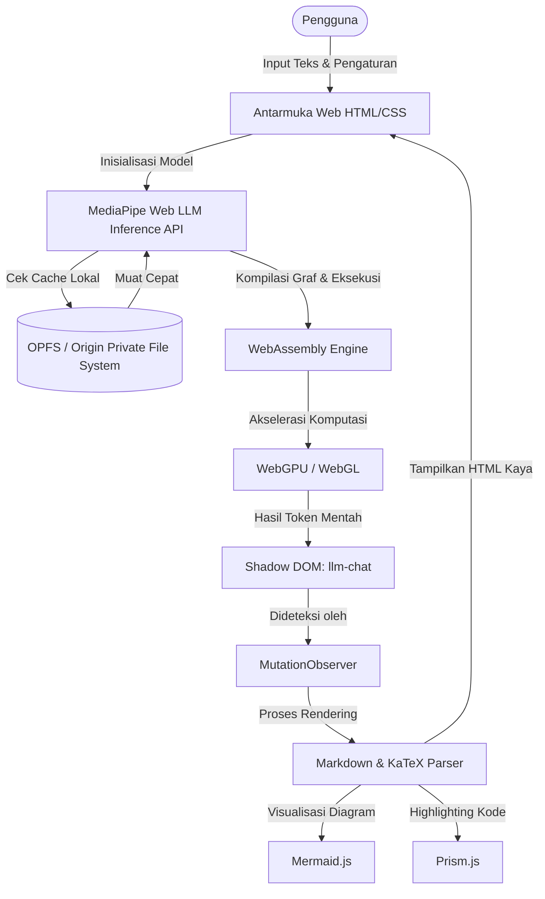

# litert-lm-WebAssembly
Proyek ini merupakan penyederhanaan dari [MediaPipe Samples
---
---
title: Gemma4
emoji: 🔥
colorFrom: blue
colorTo: gray
sdk: static
pinned: false
short_description: Chat dengan model Gemma 4 sepenuhnya di browser menggunakan MediaPipe
models:
  - litert-community/gemma-4-E2B-it-litert-lm
  - litert-community/gemma-4-E4B-it-litert-lm
  - litert-community/gemma-4-12B-it-litert-lm
  - litert-community/gemma-4-26B-A4B-it-litert-lm
  - litert-community/gemma-4-31B-it-litert-lm
---

# 🤖 Gemma 4 Web Chat & Nano AI Assistant

Gemma 4 Web Chat adalah antarmuka web modern untuk berinteraksi dengan model **Gemma 4** secara penuh di sisi klien (*on-device/fully in-browser*) menggunakan **MediaPipe Web LLM Inference API** dan WebAssembly (WASM). Proyek ini menghilangkan kebutuhan akan server backend atau kunci API berbayar, memberikan privasi penuh karena data tidak pernah meninggalkan perangkat Anda.

Proyek ini merupakan penyederhanaan dari [MediaPipe Samples](https://github.com/google-ai-edge/mediapipe-samples/tree/main/examples/llm_inference/llm_chat_ts/) dengan penyesuaian khusus untuk ekosistem Gemma 4, penghapusan autentikasi yang rumit, serta peningkatan UI/UX secara signifikan.

---

## 🌟 Fitur Utama

- ⚡ **100% Client-Side & Privat:** Seluruh proses inferensi AI berjalan langsung di browser perangkat Anda tanpa server perantara. Data Anda aman dan tidak pernah dikirim ke pihak ketiga.
- 📦 **Penyimpanan Lokal (OPFS Caching):** Mengunduh model otomatis sekali saja ke Origin Private File System (OPFS) browser, sehingga pemuatan berikutnya berjalan secara instan.
- 🧮 **Akselerasi Perangkat Keras:** Memanfaatkan WebAssembly (WASM) dan WebGPU/WebGL untuk performa inferensi yang optimal mendekati aplikasi native.
- 🎨 **Visualisasi Lengkap:** Render antarmuka yang dinamis dengan dukungan format Markdown, LaTeX untuk matematika, penyorotan sintaks kode PrismJS, dan visualisasi bagan otomatis dengan MermaidJS.
- 📄 **Asisten Dokumen Cerdas (`vision_ulti.html`):** Ekstraksi dan tanya-jawab instan dari dokumen berformat PDF, Word, Excel, maupun presentasi PPT secara offline.

---

## 🤖 Dukungan Model LLM

Aplikasi ini mendukung berbagai varian model **Gemma 4** terkuantisasi (format `.bin`/`.task`/`.litertlm` untuk MediaPipe):

1. **Gemma 4 E2B-it (1.6B parameter aktif):** Sangat ringan, cepat, membutuhkan memori minimal (~2GB VRAM/RAM). Cocok untuk perangkat dengan spesifikasi rendah/sedang.
2. **Gemma 4 E4B-it (2.7B parameter aktif):** Keseimbangan yang baik antara kecepatan dan pemahaman konteks dasar.
3. **Gemma 4 12B-it:** Model dengan kemampuan penalaran menengah yang kuat, disarankan untuk perangkat dengan RAM minimal 16GB dan GPU diskrit.
4. **Gemma 4 26B-A4B-it & 31B-it:** Model kelas berat untuk instruksi kompleks. Membutuhkan spesifikasi PC/Mac kelas atas dengan kapasitas RAM/VRAM minimal 32GB.

*Catatan: Model akan diunduh secara otomatis dari repository komunitas Hugging Face saat Anda memilihnya pertama kali di menu dropdown aplikasi.*

---

## 🏗️ Arsitektur Sistem & Aliran Data

Aplikasi ini berjalan dengan arsitektur **Serverless Client-Side**. Seluruh eksekusi AI dan manajemen data terjadi langsung di dalam sandbox browser pengguna.



### 1. Engine Inferensi (MediaPipe & LiteRT)
- **LiteRT (TensorFlow Lite untuk Edge AI):** Model Gemma 4 dikonversi ke format `.task` atau `.litertlm` yang dioptimalkan untuk eksekusi berdaya rendah.
- **WebAssembly (WASM) & GPU Delegation:** Komputasi matematika neural network didelegasikan ke GPU perangkat keras menggunakan standardisasi **WebGPU** atau **WebGL** melalui WebAssembly (WASM), menghasilkan kecepatan inferensi mendekati native.

### 2. Manajemen Memori & Cache (OPFS)
- **Origin Private File System (OPFS):** Untuk menghindari pengunduhan ulang file model berukuran gigabyte pada setiap kunjungan halaman, aplikasi menggunakan API OPFS browser (`navigator.storage.getDirectory()`). File model disimpan di penyimpanan sandboxed berkinerja tinggi langsung pada hard disk lokal Anda dan dimuat secara instan.

### 3. Rendering Interseptor (Shadow DOM & MutationObserver)
- Komponen chat bawaan berjalan di dalam *Shadow DOM* yang terisolasi. Aplikasi menggunakan `MutationObserver` untuk mendeteksi penambahan token teks mentah secara real-time dari model.
- Begitu token baru muncul, interseptor memicu pipeline parsing untuk mengonversi teks mentah menjadi representasi visual kaya dengan dukungan Markdown, LaTeX, Mermaid, dan PrismJS.

---

## 💻 Spesifikasi & Kebutuhan Perangkat Keras (Hardware Requirements)

Menjalankan Large Language Model (LLM) langsung di dalam browser membutuhkan spesifikasi perangkat keras tertentu agar berjalan dengan lancar dan responsif:

| Komponen | Spesifikasi Minimum (Model E2B / E4B) | Spesifikasi Rekomendasi (Model 12B ke atas) |
| :--- | :--- | :--- |
| **GPU / VGA** | Terintegrasi (Intel Iris Xe, AMD Radeon Vega, Apple M-Series) dengan dukungan WebGL 2.0 / WebGPU | Kartu Grafis Diskrit (NVIDIA GTX/RTX, AMD RX, Apple M-Series Pro/Max) dengan dukungan penuh **WebGPU** |
| **VRAM** | Minimal 2 GB | Disarankan 6 GB - 8 GB atau lebih |
| **RAM Sistem** | 8 GB | 16 GB atau lebih |
| **Penyimpanan** | Sisa ruang kosong minimal 5 GB (SSD sangat disarankan untuk loading cepat OPFS) | Sisa ruang kosong minimal 15 GB - 30 GB (SSD NVMe) |
| **Browser** | Chrome v113+, Edge v113+, Opera, atau Chromium-based lainnya | Chrome v120+ (dengan flag WebGPU aktif jika diperlukan) |

### 🍎 Kebutuhan Khusus macOS (Mac)
- **Apple Silicon (M-Series - M1/M2/M3/M4 & varian Pro/Max/Ultra):** Sangat direkomendasikan karena arsitektur *Unified Memory* (RAM sistem digunakan bersama sebagai VRAM). Model 12B ke atas membutuhkan setidaknya Mac dengan RAM 16 GB atau lebih besar.
- **Mac Berbasis Intel:** Memerlukan GPU diskrit AMD Radeon dengan dukungan WebGL2/WebGPU yang memadai. RAM minimal 16 GB.
- **Browser:** Gunakan **Google Chrome** atau **Microsoft Edge** versi terbaru untuk performa WebGPU terbaik. Safari saat ini masih membutuhkan aktivasi WebGPU secara manual melalui menu *Feature Flags/Developer*.

### 💻 Kebutuhan Khusus PC (Windows / Linux)
- **NVIDIA GPU:** Sangat direkomendasikan seri RTX (RTX 30-series atau lebih baru) dengan driver terbaru yang mendukung WebGPU secara native.
- **AMD GPU:** Seri RX 6000 atau lebih baru dengan driver Vulkan/DirectX 12 terbaru.
- **Sistem RAM & VRAM:** RAM minimum 16 GB sangat dianjurkan agar OS dan browser tidak kekurangan memori saat mengalokasikan buffer untuk GPU.
- **Browser di Linux:** Untuk beberapa distro Linux, Anda mungkin perlu mengaktifkan flag WebGPU secara manual di Chrome (`chrome://flags/#enable-unsafe-webgpu`) tergantung pada driver grafis yang digunakan.

---

## 🚀 Cara Menjalankan & Menyiapkan Model secara Lokal

Karena proyek ini menggunakan fitur WebAssembly tingkat lanjut dan memuat file model lokal, browser Anda memerlukan lingkungan server web lokal (bukan sekadar membuka file HTML secara langsung menggunakan `file://`).

### 📦 Menyiapkan File Model (`.task` / `.litertlm` / `.bin`)

Aplikasi ini memberikan fleksibilitas tinggi dalam memuat model AI:

1. **Unduhan Otomatis (Default):**
   Jika Anda memilih model dari daftar dropdown dan belum memilikinya di penyimpanan lokal, aplikasi akan otomatis mengunduh model dari Hugging Face dan menyimpannya ke cache OPFS browser Anda agar pemuatan berikutnya menjadi instan.

2. **Menyimpan Model di Folder Proyek (Offline Penuh):**
   Jika ingin menjalankan aplikasi secara offline penuh sejak awal tanpa menunggu unduhan browser, Anda dapat mengunduh berkas model secara manual terlebih dahulu:
   - Unduh model Gemma 4 `.task` (misalnya `gemma-4-E2B-it-web.task`) lalu letakkan file tersebut langsung di **root folder** proyek ini.
   - Untuk model Qwen, buat folder baru bernama `models` di dalam proyek, lalu letakkan berkas `.litertlm` di dalamnya dengan struktur: `models/Qwen3.5-2B_int8.litertlm`.

3. **Mengunggah Bebas dari Disk Lokal (Upload File):**
   Anda juga bisa menggunakan opsi **"Atau Unggah Model"** di bagian sidebar untuk langsung memilih berkas `.task`, `.litertlm`, atau `.bin` dari direktori mana saja di komputer Anda tanpa perlu menyalinnya ke dalam folder proyek.

---

### Metode 1: Menggunakan Skrip Python Bawaan (Sangat Direkomendasikan)
Jalankan skrip ini langsung dari terminal di folder proyek Anda:

```bash
python server.py
# Atau jika ingin menentukan port kustom (misal: 8080):
python server.py 8080
```

Setelah server aktif, buka **[http://localhost:8000](http://localhost:8000)** di browser Anda.

### Metode 2: Menggunakan server HTTP bawaan (Python Standar)
Jika Anda hanya ingin menjalankan server bawaan Python tanpa headers khusus:
```bash
python -m http.server 8000
```

### Metode 3: Menggunakan VS Code Live Server
1. Buka folder proyek di **VS Code**.
2. Instal ekstensi **Live Server**.
3. Klik tombol **Go Live** di sudut kanan bawah status bar VS Code.

---

## 📂 Struktur File Utama

- [`index.html`](file:///Users/subuhkurniawan/Gemma4/index.html): Antarmuka obrolan utama untuk interaksi teks lokal dengan Gemma 4.
- [`vision_ulti.html`](file:///Users/subuhkurniawan/Gemma4/vision_ulti.html): Antarmuka Nano AI Assistant tingkat lanjut dengan fitur pembaca dokumen (PDF/Word/Excel) dan visualisasi data.
- [`server.py`](file:///Users/subuhkurniawan/Gemma4/server.py): Skrip server lokal dengan header keamanan WASM COOP/COEP.
- [`bundle.js`](file:///Users/subuhkurniawan/Gemma4/bundle.js): Kompilasi modul MediaPipe LLM Inference API untuk browser.
- `nano_asset/`: Kumpulan pustaka Javascript (JS) dan CSS lokal untuk mendukung operasi offline sepenuhnya.

---

## 🛠️ Troubleshooting & FAQ

### 1. Pesan kesalahan: "WebGPU is not supported / detected"
- **Solusi:** Pastikan Anda menggunakan browser berbasis Chromium (Google Chrome, Microsoft Edge, Arc, Opera) versi terbaru. Jika menggunakan Linux atau perangkat tertentu, Anda mungkin perlu mengaktifkan bendera (flag) secara manual:
  1. Buka tautan `chrome://flags/#enable-unsafe-webgpu` di bilah alamat browser.
  2. Ubah pengaturannya menjadi **Enabled**.
  3. Muat ulang (relaunch) browser Anda.

### 2. Browser atau tab keluar sendiri (Crash / Out of Memory)
- **Solusi:** Hal ini terjadi karena model LLM yang dipilih menggunakan memori lebih besar dari RAM/VRAM yang tersedia di perangkat Anda. Coba segarkan halaman dan pilih varian model yang lebih kecil (misalnya model **E2B-it** atau **E4B-it**).

### 3. Proses download model macet atau sangat lambat
- **Solusi:** File model memiliki ukuran 1.5 GB hingga lebih dari 10 GB. Pastikan koneksi internet Anda stabil dan memiliki sisa ruang penyimpanan hard disk yang cukup pada drive instalasi browser Anda.

---

## 📖 Referensi Resmi

- [Dokumentasi MediaPipe Web LLM Inference API](https://ai.google.dev/edge/mediapipe/solutions/genai/llm_inference/web_js)
- [Gemma 4 Model Hub di Hugging Face](https://huggingface.co/models?search=gemma-4)
